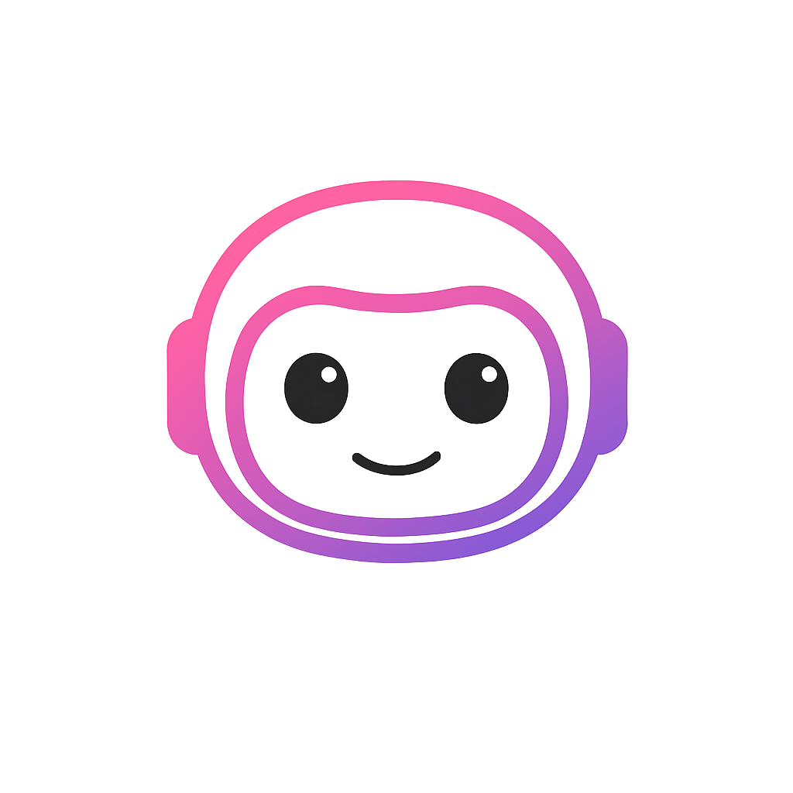

# Ezia AI - Votre Chef de Projet IA

  

## 🚀 À propos d'Ezia

Ezia est votre chef de projet IA qui coordonne une équipe d'agents spécialisés pour créer vos projets web. Discutez naturellement avec Ezia et son équipe pour créer des sites web professionnels sans écrire une ligne de code.

### 🤖 L'équipe Ezia

- **Ezia** - Chef de projet IA, coordonne l'équipe
- **Kiko** - Expert en développement technique
- **Milo** - Spécialiste branding et naming
- **Yuna** - Experte UX et recherche utilisateur
- **Vera** - Spécialiste contenu et SEO

## 🛠️ Technologies

- **Frontend**: Next.js 15, React 19, TypeScript, Tailwind CSS
- **Backend**: Node.js, MongoDB, API Routes
- **IA**: Mistral AI, HuggingFace Inference API
- **Infrastructure**: Docker

## 📋 Configuration requise

Cette application nécessite les variables d'environnement suivantes (à configurer dans les Settings du Space) :

- `MONGODB_URI` - URI de connexion MongoDB
- `HF_TOKEN` - Token HuggingFace pour l'API
- `DEFAULT_HF_TOKEN` - Token de fallback
- `MISTRAL_API_KEY` - Clé API Mistral
- `JWT_SECRET` - Secret pour les JWT
- `NEXTAUTH_SECRET` - Secret pour NextAuth

## 🔗 Liens

- [Code Source](https://github.com/hmorales-pro/ezia-ai)
- [Documentation](https://github.com/hmorales-pro/ezia-ai/tree/main/docs)
- [Support](mailto:support@ezia.ai)

## 📄 License

MIT License - Voir [LICENSE](https://github.com/hmorales-pro/ezia-ai/blob/main/LICENSE)